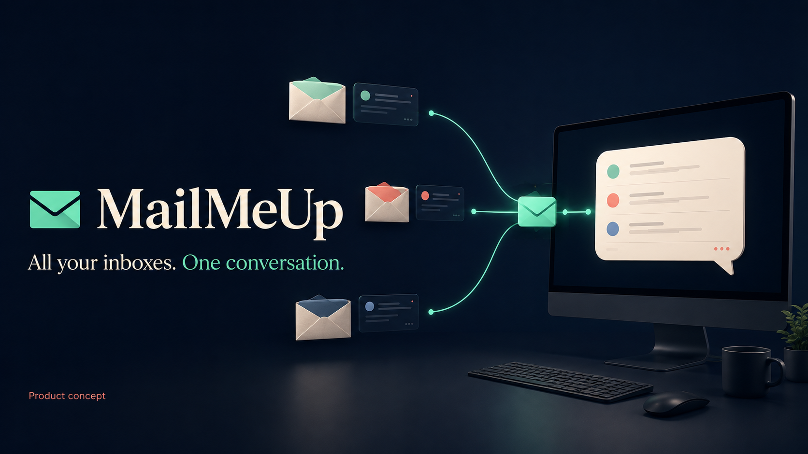
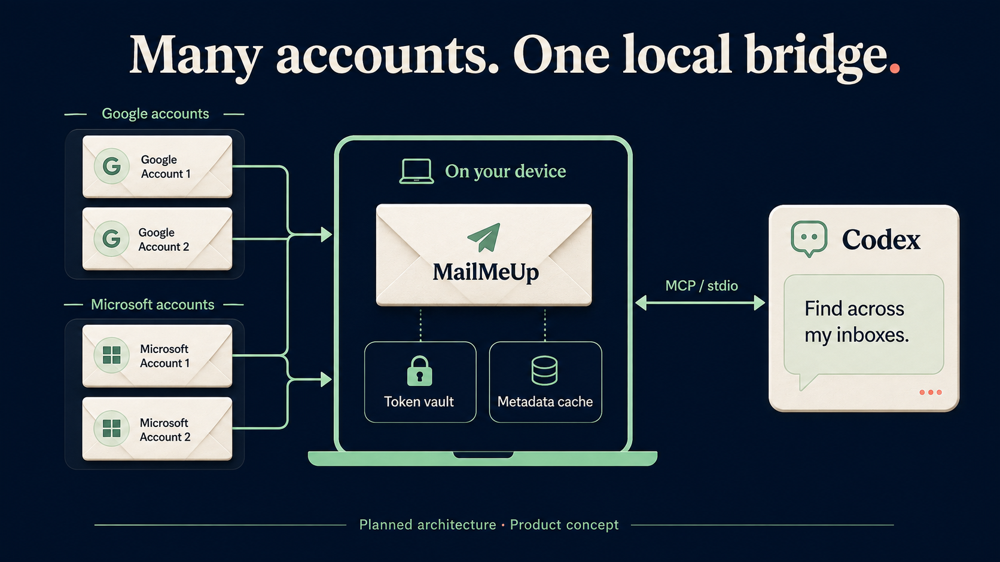

  

# MailMeUp

**All your inboxes. One conversation.**

Bring your email and appointments from multiple Google and Microsoft accounts into Codex or another compatible AI assistant.

> [!WARNING]
> **MailMeUp is pre-alpha software.** It is intended for development and supervised testing. Commands, setup steps and stored local data may change before the first stable release.

> **Read-only by design for the current scope.** MailMeUp will help you find and read information. It will not send email, change messages, create or edit appointments, delete anything from your accounts, or send invitations.

## What it will do

- Search across Gmail, Google Workspace, Outlook.com and Microsoft 365 inboxes.
- List unread messages or messages in a received-time range, with optional sender, recipient and attachment filters.
- Show appointments from Google Calendar and Microsoft calendars.
- Let you choose which accounts and calendars to include.
- Return short results first, then open the details you need.

MailMeUp runs on your computer. Each user connects their own accounts. No marketplace or hosted service is required.

## What works today

**The current pre-alpha build is usable for supervised testing on Windows x64. It is not a stable release.**

> [!IMPORTANT]
> **Provider setup is currently required.** To connect Google or Microsoft accounts, each user must currently register their own OAuth desktop application and configure its Client ID locally. Google also requires the downloaded desktop client configuration file; Microsoft requires its Application (client) ID. No provider credentials are bundled with MailMeUp. Follow the [provider setup and CLI guide](docs/APP_REGISTRATION.md). We are actively working on a simpler onboarding experience.

The current source includes local provider setup, interactive multi-account sign-in, compact cross-account mail search and a combined calendar agenda. Mail searches exclude Spam/Junk and Trash/Deleted Items by default. Client credentials and account token caches use operating-system protection. Read-only flows have been exercised with two Google and two Microsoft accounts on Windows without including account content in the validation output.

The Windows build passed 68 automated tests and read-only checks across four real accounts. Recovery, partial results and calendar boundaries have synthetic regression coverage; clean installation and the pilot remain. See the [validation record](docs/VALIDATION.md) and [account recovery guide](docs/RECOVERY.md).

## AI assistant support

Development currently focuses only on OpenAI's Codex. MailMeUp uses the standard Model Context Protocol (MCP) over stdio, so it may also work with other compatible clients, including Claude. Claude compatibility has not been tested.

Contributors interested in Claude are welcome to help with compatibility testing, setup documentation and any necessary integration work. See [how to contribute](CONTRIBUTING.md).

## Platform status

- **Windows x64:** current MVP target; the packaged executable is tested before and after ZIP extraction.
- **Windows ARM64:** package builds, but has not been executed on ARM64 hardware.
- **macOS and Linux:** not tested, including browser OAuth sign-in and protected token storage. Support is not claimed for the current MVP.

## How it fits together

*Concept artwork for the email workflow. Calendars are also in scope. Information requested by your assistant may be sent to its AI service; running locally does not mean all processing is offline.*

## Explore the project

- [Short product overview](docs/PRODUCT.md)
- [Roadmap](docs/ROADMAP.md)
- [Steps to a testable MVP](docs/MVP_PLAN.md)
- [Getting started](docs/GETTING_STARTED.md)
- [Calendars and appointments](docs/CALENDARS.md)
- [Accounts and credentials](docs/AUTHENTICATION.md)
- [Register the app with Google and Microsoft](docs/APP_REGISTRATION.md)
- [Privacy](docs/PRIVACY.md)
- [Connect to Codex](docs/CODEX_SETUP.md)
- [Build and contribute](docs/DEVELOPMENT.md)

For developers: [architecture](docs/ARCHITECTURE.md), [MCP tools](docs/MCP_CONTRACT.md), [release process](docs/RELEASING.md) and [validation results](docs/VALIDATION.md).

Created by [Umberto Giacobbi](https://github.com/umbertotechnopreneur). [MIT license](LICENSE). [Contributions](CONTRIBUTING.md) and [security reports](SECURITY.md) are welcome. Independent project; no endorsement by OpenAI, Google or Microsoft.

Brand assets and generation prompts: [brand guide](docs/BRAND.md).
