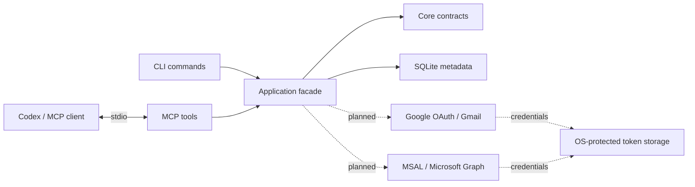

# Architecture

Status: foundation implemented; provider operations and OS credential adapters pending.

## Boundaries

| Module | Owns | Does not own |
| --- | --- | --- |
| Core | Account metadata, store and provider contracts | SDKs, serialization, SQL |
| Application | Shared use cases and readiness | Console rendering or MCP transport |
| Storage | SQLite schema and local paths | OAuth credentials |
| Security | Protected credential persistence contract | Mail search or UI |
| Providers.Google | Google module and future Gmail adapter | Global pagination or CLI |
| Providers.Microsoft | Microsoft module and future Graph adapter | Global pagination or CLI |
| Mcp | Tool descriptions and compact wire results | Direct provider authentication |
| Cli | Arguments, DI composition, process lifetime | Business logic duplicated from Application |

The executable references and composes these modules. Core has no package dependencies. Security and providers are deliberately small boundaries, not simulated integrations.

## Process and transport

`mailmeup --stdio` starts one local child process. The MCP SDK owns newline-delimited JSON-RPC on stdin/stdout. There is no HTTP listener or MCP bearer token in this design. Console logging is restricted to stderr at warning level. Interactive account setup will be a separate command so a login prompt cannot corrupt MCP traffic.

The host disables automatic appsettings/environment configuration providers; the composition root explicitly reads `MAILMEUP_DATA_DIR`. Ordinary `status` and `accounts list` commands return JSON. Help may use Spectre.Console when attached to a terminal.

## Storage

`accounts.db`, schema version 1, contains `id`, `provider`, `display_name`, `email_address`. IDs are local and distinct across providers even when addresses match. No token or provider-subject fields are stored yet. First-run discovery does not create files. Writes use parameterized SQL, short connections and a busy timeout. Unknown schema versions fail; they are never silently reset.

The foundation supports metadata persistence through `IAccountStore`; it intentionally has no command for inventing authenticated accounts. A future OAuth flow must save metadata only after identity is established. Provider identity mapping, credential references, account removal and migrations belong to that milestone.

## Future search coordinator

Application will resolve account scope, dispatch provider-specific filters with bounded concurrency, merge results and maintain a cursor for each provider/account. One global page limit applies across all selected accounts. Opaque local message references map back to an account and a provider message ID. Token refresh must be coordinated across processes; SQLite connection safety alone does not solve OAuth refresh races.

## Technical choices

.NET 10 LTS, the official MCP C# SDK, Microsoft.Data.Sqlite and Spectre.Console are pinned centrally with NuGet lock files. The release uses self-contained single-file publishing with native library extraction. Trimming and Native AOT are not enabled. The provider SDKs and credential adapters will be selected and tested when those integrations are implemented.
