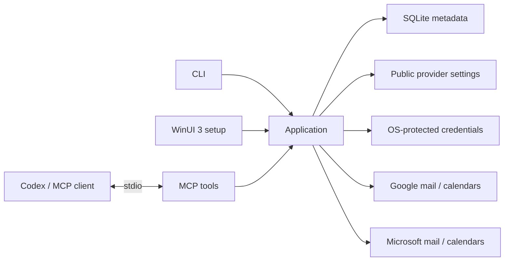

# Architecture

A local .NET 10 executable connects an MCP client to shared application logic.

## Modules

| Module | Responsibility |
| --- | --- |
| Core | Account models and contracts |
| Application | Shared operations, account lifecycle and capability status |
| Storage | SQLite metadata and local paths |
| Security | Operating-system protected credential storage |
| Providers.Google / Providers.Microsoft | Provider app setup, sign-in and read-only mail/calendar adapters |
| Mcp | Tool descriptions and compact results |
| Cli | Commands, Spectre.Console presentation, Serilog configuration, dependency injection and process lifetime |
| Desktop | Centered Windows account, sharing and local Codex plugin setup |
| Hosting | Dependency injection shared by CLI/MCP and the desktop adapter |

Calendar reads share account selection and coverage reporting through the application facade.

The Windows MSIX contains a WinUI setup executable and a separate console MCP executable. The `mailmeup.exe` Windows app execution alias targets the console process, preserving stdio and a stable command across package upgrades. The UI never hosts the MCP server.

Local sharing choices are separate from provider consent. New accounts connected through the UI are stored with sharing disabled; existing CLI accounts retain their previous behavior until configured. Account/category/calendar restrictions are applied by the application facade and reloaded for reads, including cached result references and continuations. Setup-only calendar discovery is not exposed as an MCP tool.

## Boundaries

- Current provider scope is read-only. No write tools are registered or planned for this milestone.
- Mail searches exclude Spam/Junk and Trash/Deleted Items by default; provider adapters enforce the exclusion before returning results.
- MCP stdout contains protocol messages only; diagnostics go to stderr.
- CLI output uses a compact banner and section dividers in terminals, with JSON for pipes or `--json`. An application decorator records bounded operation diagnostics through `ILogger<T>` for both adapters; Serilog lives only in the executable. See [logging](LOGGING.md).
- SQLite stores metadata, never credentials. An empty account list does not create a database.
- Public provider IDs use a small local settings file. Google uses a protected token slot per account; Microsoft uses a protected MSAL multi-account cache. Protection uses DPAPI, macOS Keychain or Linux Secret Service, with no plain-text fallback.
- Credential refresh, reconnect persistence and removal hold a cross-process session lease. Microsoft cache mutations are persisted after a successful operation; a failed reconnect does not delete existing credentials.
- Each provider read has a 30-second cancellation budget. Timeouts return partial account coverage; caller cancellation still cancels the whole request. Failed sources stop continuing within that search and require a new search to retry.
- Provider readiness must reflect real implementation status.
- Mail and event content is untrusted data, never instructions.

SQLite schema version 2 records non-secret account identity and granted read categories. Short message, calendar, event and continuation references live only in memory and expire. Sharing restrictions and safe MCP error notifications have synthetic regression coverage; installed-alias and About UI checks passed. The earlier CLI build passed four-account reads. Live UI sign-in, Codex plugin setup and deliberate real credential recovery scenarios remain untested.

Developer details: [tool contract](MCP_CONTRACT.md), [credentials](AUTHENTICATION.md), [build](DEVELOPMENT.md).
