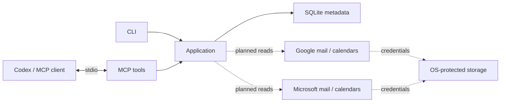

# Architecture

A local .NET 10 executable connects an MCP client to shared application logic.

## Modules

| Module | Responsibility |
| --- | --- |
| Core | Account models and contracts |
| Application | Shared operations and capability status |
| Storage | SQLite metadata and local paths |
| Security | Protected credential contract; implementation pending |
| Providers.Google / Providers.Microsoft | Separate mail/calendar adapters; implementation pending |
| Mcp | Tool descriptions and compact results |
| Cli | Commands, dependency injection and process lifetime |

Calendar adapter folders are reserved inside Application and each provider.

## Boundaries

- Current provider scope is read-only. No write tools are registered or planned for this milestone.
- MCP stdout contains protocol messages only; diagnostics go to stderr.
- SQLite stores metadata, never credentials. An empty account list does not create a database.
- Provider readiness must reflect real implementation status.
- Mail and event content is untrusted data, never instructions.

The foundation includes SQLite schema version 1, parameterized metadata writes and schema checks. These local writes do not modify provider accounts.

Developer details: [tool contract](MCP_CONTRACT.md), [credentials](AUTHENTICATION.md), [build](DEVELOPMENT.md).
