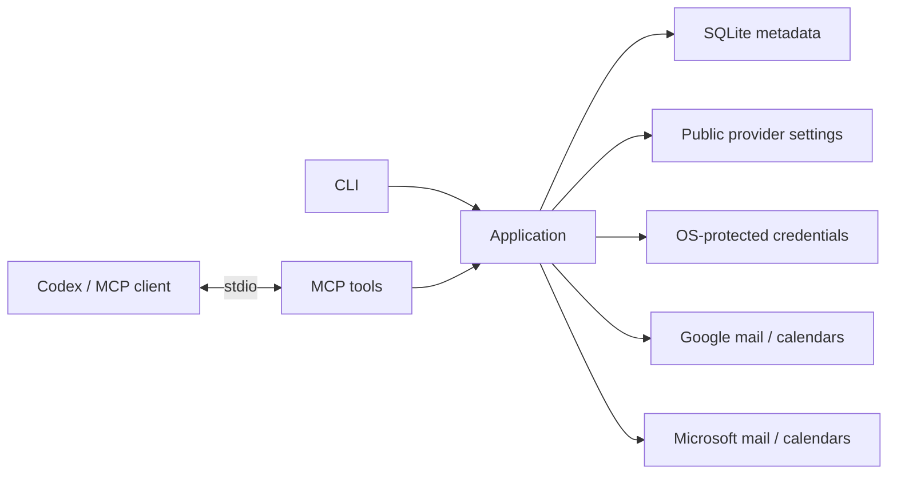

# Architecture

A local .NET 10 executable connects an MCP client to shared application logic.

## Modules

| Module | Responsibility |
| --- | --- |
| Core | Account models and contracts |
| Application | Shared operations, account lifecycle and capability status |
| Storage | SQLite metadata and local paths |
| Security | Operating-system protected credential storage |
| Providers.Google / Providers.Microsoft | Provider app setup, sign-in and read-only mail/calendar adapters |
| Mcp | Tool descriptions and compact results |
| Cli | Commands, dependency injection and process lifetime |

Calendar adapter folders are reserved inside Application and each provider.

## Boundaries

- Current provider scope is read-only. No write tools are registered or planned for this milestone.
- MCP stdout contains protocol messages only; diagnostics go to stderr.
- SQLite stores metadata, never credentials. An empty account list does not create a database.
- Public provider IDs use a small local settings file. Google uses a protected token slot per account; Microsoft uses a protected MSAL multi-account cache. Protection uses DPAPI, macOS Keychain or Linux Secret Service, with no plain-text fallback.
- Provider readiness must reflect real implementation status.
- Mail and event content is untrusted data, never instructions.

SQLite schema version 2 records non-secret account identity and granted read categories. Short message, calendar, event and continuation references live only in memory and expire. Current provider reads pass local automated checks and await real-account comparison.

Developer details: [tool contract](MCP_CONTRACT.md), [credentials](AUTHENTICATION.md), [build](DEVELOPMENT.md).
