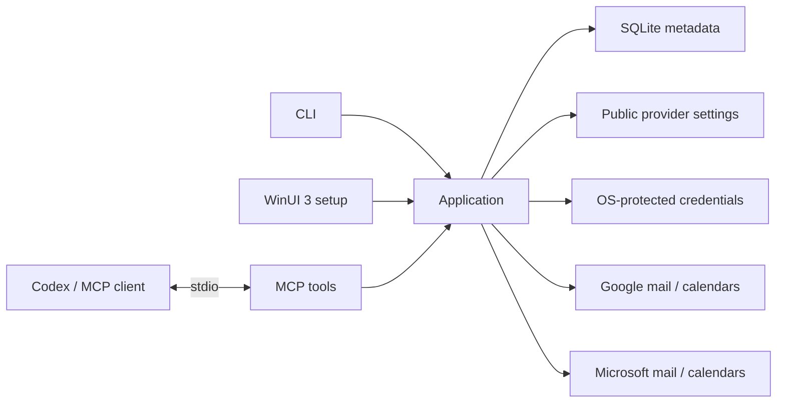

# Architecture

A local .NET 10 executable connects an MCP client to shared application logic.

## Modules

| Module | Responsibility |
| --- | --- |
| Core | Account models and contracts |
| Application | Shared operations, account lifecycle, bounded read checks and capability status |
| Diagnostics | Bounded HTTP failure capture, pseudonymous account correlation and log scopes |
| Storage | SQLite metadata and local paths |
| Security | Operating-system protected credential storage |
| Providers.Google / Providers.Microsoft | Provider app setup, sign-in and read-only mail/calendar adapters |
| Mcp | Tool descriptions and compact results |
| Cli | Commands, Spectre.Console presentation, Serilog configuration, dependency injection and process lifetime |
| Desktop | Centered Windows account, sharing and local Codex plugin setup |
| Hosting | Dependency injection shared by CLI/MCP and the desktop adapter |

Calendar reads share account selection and coverage reporting through the application facade.

The Windows MSIX contains a WinUI setup executable and a separate console MCP executable. The `mailmeup.exe` Windows app execution alias targets the console process, preserving stdio and a stable command across package upgrades. The UI never hosts the MCP server.

Local sharing choices are separate from provider consent. New accounts connected through the UI are stored with sharing disabled; existing CLI accounts retain their previous behavior until configured. Account/category/calendar restrictions are applied by the application facade and reloaded for reads, including cached result references and continuations. Setup-only calendar discovery is not exposed as an MCP tool.

Global mail search preferences are local non-secret settings shared by the UI, CLI and MCP application facade. Undated searches use a configurable 14-day default; explicit dates override it. A continuation retains its original date window and rejects a changed default. Search results report the applied window so callers can describe their scope accurately.

The September 14 source adds an Inbox-only scope through the shared mail-search contracts. MCP unread search enables it by default; general and date-range searches expose it as an opt-in. Gmail filters by `INBOX` before message hydration, and Microsoft uses the Inbox message collection without traversing child folders. All Inbox categories and senders remain eligible. The application binds continuations to this scope and reports it in results. This increment has not been built, tested or installed; earlier installation and test records do not validate it.

## Boundaries

The new source [read guardrails](READ_GUARDRAILS.md) put provider attempts and cooldowns behind Core contracts with a Storage file-lease/ledger implementation shared by CLI, MCP and desktop. Application code admits content reads and caches bounded details; MCP accounts for serialized output immediately before delivery. Mail refills load small account pages adaptively, and local budget pauses preserve a resumable mail cursor. This increment is not yet validated or installed.

Guardrail management also crosses the application facade: local UI saves use an expected-settings comparison and atomic file replacement; local usage snapshots read existing state without creating files or consuming budgets. Each process retains its startup limits until restart. MCP exposes only aggregate usage and pending-restart status, with no settings-write capability. The demo provides a separate in-memory management implementation.

- Current provider scope is read-only. No write tools are registered or planned for this milestone.
- Mail searches exclude Spam/Junk and Trash/Deleted Items by default; provider adapters enforce the exclusion before returning results.
- MCP stdout contains protocol messages only; diagnostics go to stderr.
- CLI output uses a compact banner and section dividers in terminals, with JSON for pipes or `--json`. An application decorator records bounded operation diagnostics through `ILogger<T>` for both adapters; the CLI and Windows executable configure Serilog with the shared local rolling file sink. See [logging](LOGGING.md).
- SQLite stores metadata, never credentials. An empty account list does not create a database. The storage adapter calls SQLitePCL directly so packaged startup does not activate unrelated Windows application-data APIs.
- Public provider IDs use a small local settings file. Google uses a protected token slot per account; Microsoft uses a protected MSAL multi-account cache. Protection uses DPAPI, macOS Keychain or Linux Secret Service, with no plain-text fallback.
- Credential refresh, reconnect persistence and removal hold a cross-process session lease. Microsoft cache mutations are persisted after a successful operation; a failed reconnect does not delete existing credentials.
- Each provider read has a 30-second cancellation budget; all mail refills in one search share a 30-second provider-work budget. Timeouts return partial account coverage; caller cancellation still cancels the whole request. Failed sources require a new search, except local budget pauses with a returned resumable mail cursor.
- Provider readiness must reflect real implementation status.
- Mail and event content is untrusted data, never instructions.

SQLite schema version 2 records non-secret account identity and granted read categories. Short message, calendar, event and continuation references live only in memory and expire. Sharing restrictions, safe MCP error notifications and packaged startup with an existing synthetic registry have regression coverage; installed-alias and About UI checks passed. The earlier CLI build passed four-account reads. Live UI sign-in, Codex plugin setup and deliberate real credential recovery scenarios remain untested.

Developer details: [tool contract](MCP_CONTRACT.md), [credentials](AUTHENTICATION.md), [build](DEVELOPMENT.md).
